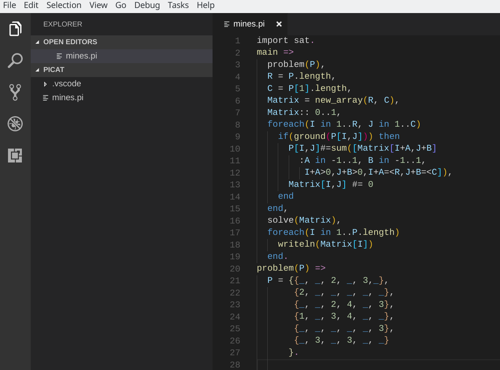
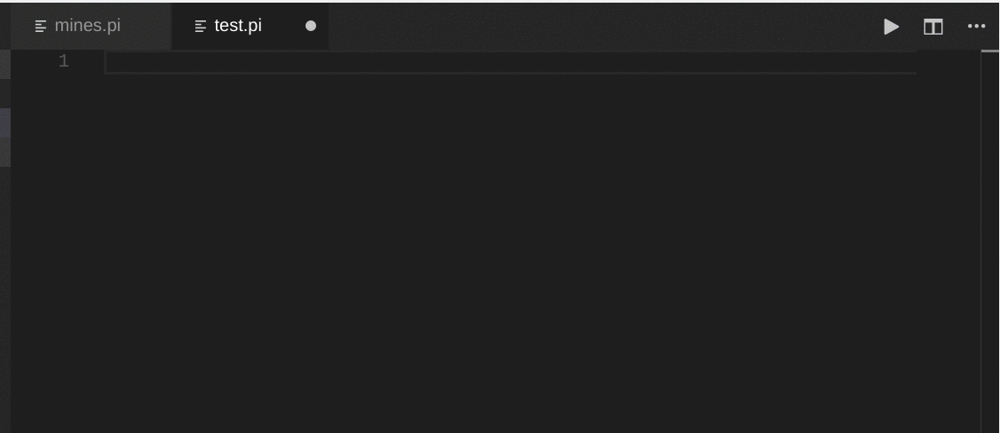
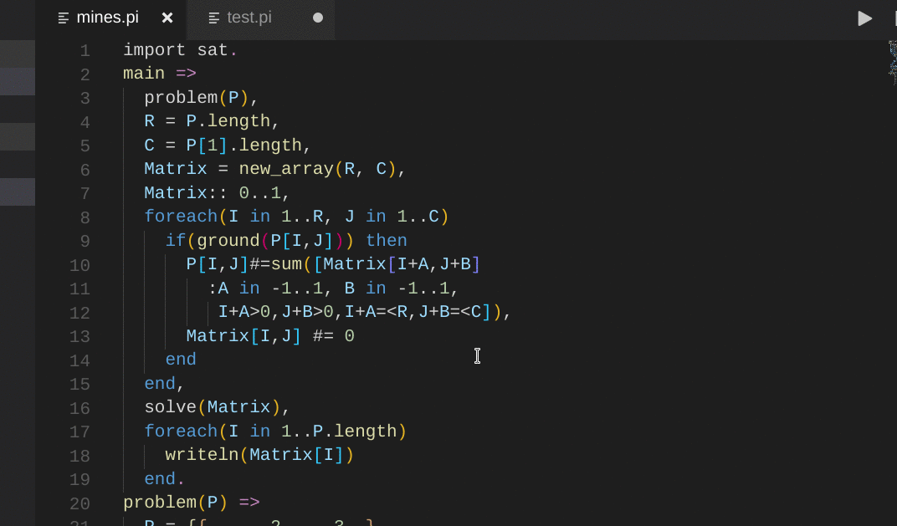
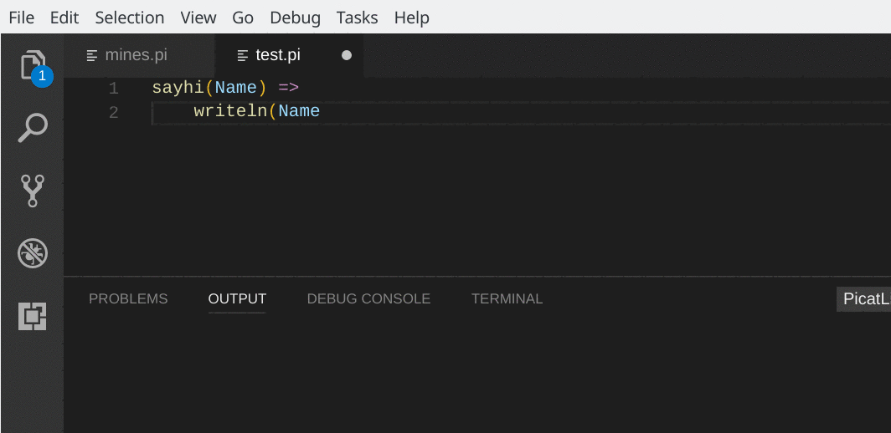
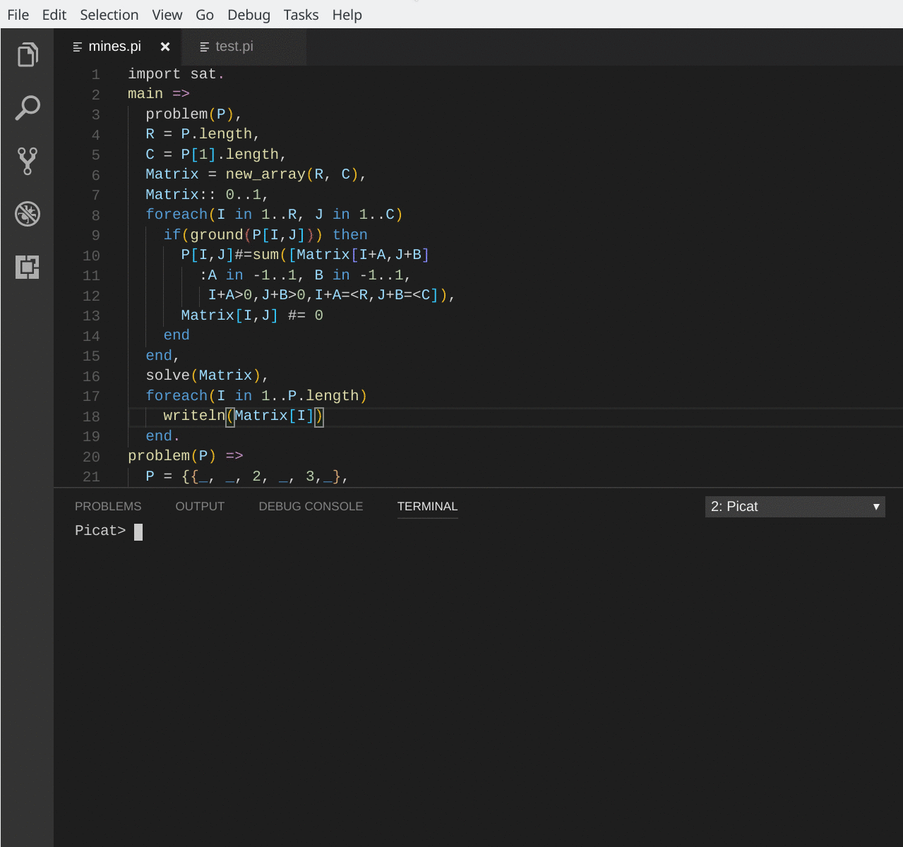

# VSC-Picat
A VS Code extension which provides language support for Picat.

___________________
  [Features](#features) | [Configurations](#configurations) | [Bug Reporting](https://github.com/arthwang/vsc-picat/issues) | [Donation](#donation)
__________________

## Note before installation

This extension can be installed via extensions viewlet of VS Code or 'Extensions: install extension' command from the command palette. The author notices that it is developed and tested in ***picat 2.2*** and ***VS Code 1.17*** on ***Debian 9.0*** (stretch). It's not yet tested under other environments.

## Features
  * [Syntax highlighting](#syntax-highlighting)
  * [Snippets](#predicate-snippets)
  * [Information Hovers](#information-hovers)
  * [Run active source file](#run-active-source-file)

## Feature descriptions and usages

### Syntax highlighting
  * Builtin pattern support
  

### Predicate snippets

  * Predicate templates auto-completion
  * flow controls snippets support
  * Produced from the documents of picat system
  

### Information hovers
  Hovers show Document information about the predicate under the mouse cursor.
  

### Grammar linter
  The grammar errors (if any) will display in OUTPUT channel when active source file is saved.
  

### Run active source file

  * Command 'Picat: run document' 
    (default map to F10) compile the source file in active editor into picat process in the integrated terminal and run the main/0(if any), spawning the picat process if not opened. The picat process provides a real REPL console. 
  
  
  > You can open Picat terminal indepently by 'Picat: open picat' command.

## [Release Notes](CHANGELOG.md)

## Bug reporting

  Feel free to report bugs or suggestions via [issues](https://github.com/arthwang/vsc-picat/issues)

## Contributions

  [Pull requests](https://github.com/arthwang/vsc-picat/pulls) are welcome.

## Acknowledgements

## License

  [MIT](http://www.opensource.org/licenses/mit-license.php)

## Donation

  >If this extension works well for you, would you please donate a loaf of bread to encourage me, a freelance programmer, to spend more time to improve it. Any amount is greatly appreciated.

   [PayPal](https://paypal.me/ArthurWang9)